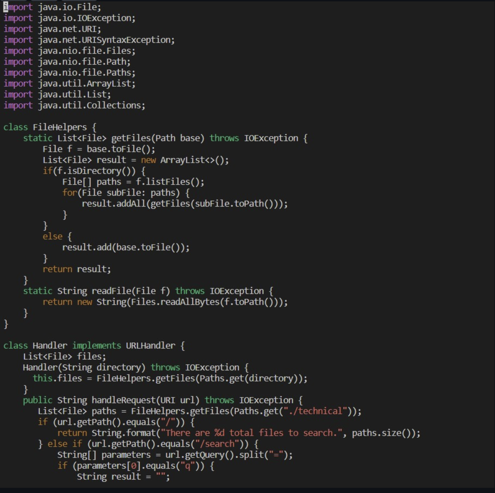
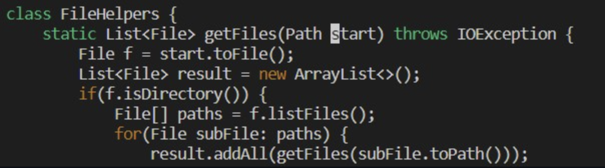
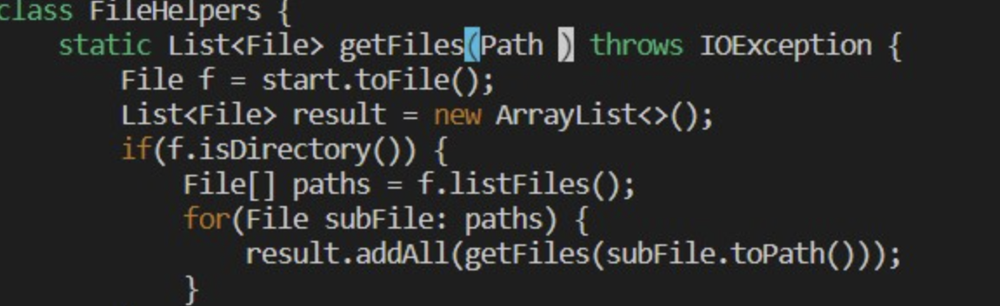
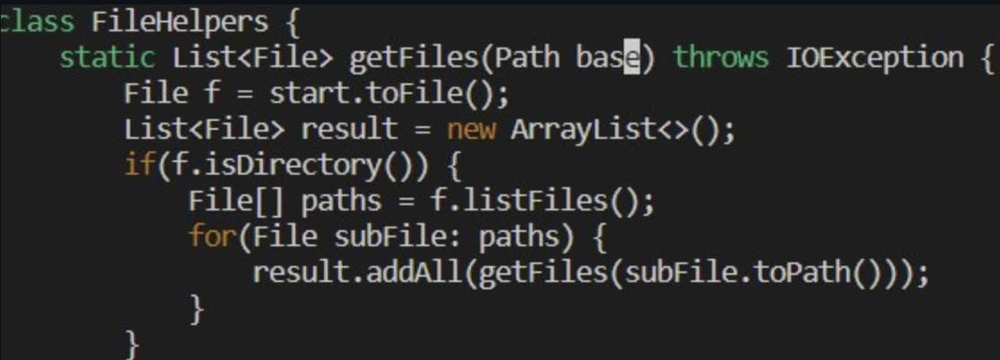
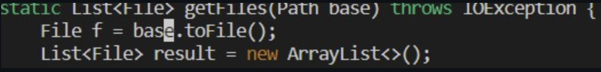
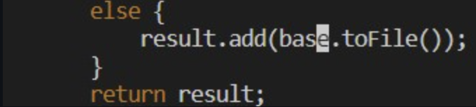
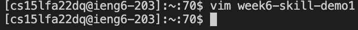

# Lab 4
**Author**: ***Rishabh Kalyanakumar***
#
# Part 1
Instructions: 
1. ```vim D``` ```<tab>``` ``` <Enter>```
2. ``` /star``` ```<Enter>```
3. ```ce```
4. ```base``` ```<esc>```
5. ```n.```
6. ```n.```
7. ```:wq``` ```<Enter>```
# 
1. ```vim D``` ```<tab>``` ```<Enter>```
```DocSearch.java``` file opened in vim:
     


 2. ```/star``` ```<Enter>``` , This shows the first instance of ```start``` being highlighted (first letter):
  

 3. ```ce```  
 The word ```start``` being deleted and it going into insert mode:  

   

 4. ```base ``` ```esc```  
 ```start``` is replaced by ```base ``` and it goes back to normal mode:  

   

 5. ```n.```  
   vim searching and replacing ```start``` with ```base```  

   

 6. ```n.```  
   vim searching and replacing ```start``` with ```base```
   

 7. ```:wq``` ```<Enter>```
   saving + exiting vim and returning to terminal:  

  


# Part 2
Vscode Time after editing and copying over file: 38 seconds

vim Time with edits: 24 seconds

The only dificulty that was expericenced was when I was using Vscode when I was trying to find all the ```start``` cases manually.

***Question 1***

I think I prefer to use Vscode to work on programs remotley, the reasoning behind this is that I have been using Vscode for the last 2 years for most of my CSE classes so I am very confident navigating it. I think over time if I learn the ins and outs of vim and get more familarized with it I would eventually make the switch to vim from Vscode because its quicker and more efficent.

***Question 2***

I don't think any factor would make me switch from Vscode to vim currently because I am already familar with it and I feel like it is more "user friendly". Going into the future though I think when I am working with larger projects and many more files I think I will be forced to practice vim and use it in my day to day life because it is so much quicker and efficent than Vscode.

