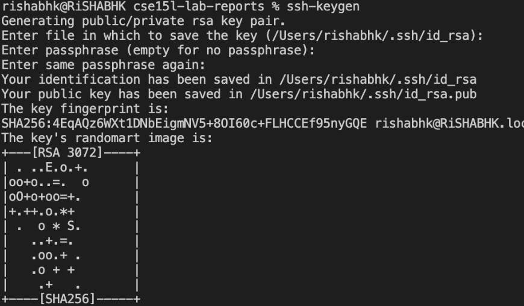

Welcome to CSE15L!  

A) INTRO/ Setting up your Account

- This weeks lab is going to an introduction on how to remotely access the computers in the basement of the CSE building while getting used to working with command prompts in your terminal.
Step one: Logging into your CSE15L Account
Start by looking up your Course specific account for CSE15L Here: https://sdacs.ucsd.edu/~icc/index.php

- If you have not reset your password yet please do so by using this link as a referenc and follow the directions: https://docs.google.com/document/d/1hs7CyQeh-MdUfM9uv99i8tqfneos6Y8bDU0uhn1wqho/edit

1) ***Step Two Visual Studio Code***  
- If you haven't already make sure you download Visual Studio Code. https://code.visualstudio.com/ There are versions for all the majors operating systems.There are detailed instructions on how to set VsCode on your laptop

- After you have successfully installed Visual Studio and open it for the first time you should run into something that looks like this (Don't worry if your window does not look exactly the same ): 
  

2) ***Remotely Connecting***   
- Now lets opne up the terminal in VSCode (go to the top of your screen click on terminal and click on the New Terminal menu option) 

- the first thing you should enter is:  
$ ssh cs15lfa22zz@ieng6.ucsd.edu  
You will then get a message saying something along the lines of "The authenticity of host 'ieng6.ucsd.edu ... can't be established... Are you sure you want to continue connecting (yes/no[fingerprint])?"  
After recieving this message you should type yes and press enter.  
- In your terminal you should recieve a message like this one: .

- Congratulations if you recieved this message your terminal is connected to a computer in the CSE basement and the commands you run will run remotely

3) ***Trying Some Commands***  
-  Try running some of the basic commands in your terminal and see what its functions are.   
  
- You may have noticed that ls lists all the files in the directory, cd changes the directory and so on and so forth.  
 

4) ***Moving Files With scp*** 
- So far we have worked with basic commands in your terminal, now we are going to step it up a notch and learn how to copy files back and forth between computers!  

- The command that we are going to use for this is scp  
First create a file on your computer called WhereAmI.java and attach the following code into the file:  

class WhereAmI {  

  public static void main(String[] args) {
    System.out.println(System.getProperty("os.name"));
    System.out.println(System.getProperty("user.name"));
    System.out.println(System.getProperty("user.home"));
    System.out.println(System.getProperty("user.dir"));
  }
}  

- Next you are going to compile and run the WhereAmI program using javac and java commands You will do this by running the following commands one after the other:  

- javac WhereAmI.java  
- java WhereAmI  

  
- Next run the following commands in the terminal (using your username)  
- scp WhereAmI.java cs15lfa22zz@ieng6.ucsd.edu:~/   
 
- Next log into ieng6 with ssh and use ls and use getProperty (I ran into an error at this part when using getProperty) 
- you should see something simmilar to the screenshot below:
  

  

5) *** Setting a SSH Key***  
- Everytime we login we have to type in our password this can get annoying and wastes a lot of time to avoid this we are going to set up a SSH key.  
-The program that lets us do this is ssh-keygen type this into your terminal, you should run into something like this:  
  
- Now this has created two new files on your system the private key (in a file id_rsa) and the public key (in a file id_rsa.pub), stored in the .ssh directory on your laptop.  
- Next follow the steps in the screenshot to login with entering your password everytime:  
  

6) ***Optimizing Remote Runnning***  
- you can now write a command in quotes at the end of ssh command to directly run it in a remote server, this would look something like:  
- $ ssh rkalyanakumar@ieng6.ucsd.edu "ls"
and it would then list all the files in the directory you are in.

