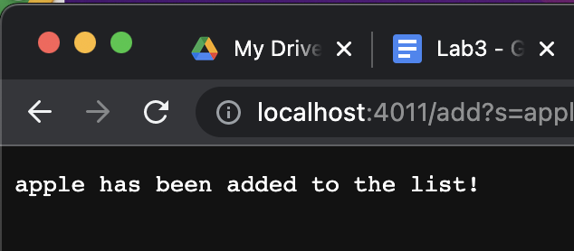

# **Lab 2:**
Author: *Rishabh Kalyanakumar*

# ***Part 1***

1) Code for the Search Engine:  

# 

    class Handler implements URLHandler {
    // The one bit of state on the server: a number that will be manipulated by
    // various requests.
   
    ArrayList<String> stringItem = new 
    ArrayList<String>();

    String matches = "";

    public String handleRequest(URI url) {
        if (url.getPath().equals("/")) {
            return String.format(
                    "Welcome to Rishabhs Search Engine\nUse the 'add' path to add an string to the list");
        } else {
            if (url.getPath().contains("/add")) {

                String[] box = url.getQuery().split("=");

                if (box[0].equals("s")) {
                    stringItem.add(box[1]);
                    return String.format("%s has been added to the list!", box[1]);
                }
            }
            if (url.getPath().contains("/search")) {
                System.out.println(stringItem);
                String[] box = url.getQuery().split("=");
                ArrayList<String> storage = new ArrayList<String>();

                if (box[0].equals("s")) {
                    for (int i = 0; i < stringItem.size(); i++) {
                        if (stringItem.get(i).contains(box[1])) {
                            storage.add(stringItem.get(i));
                        }
                    }
                }

                if (matchStor.size() > 0) {
                    return String.format("The search term matches the following strings in the list: %s",
                            matchStor.toString());
                } else {
                    return String.format("No strings matched '%s'", box[1]);
                }

            } else {
                return "404 Not Found!";
            }
        }

    }}

    public class SearchEngine {

    public static void main(String[] args) throws 
    
    IOException {
        
        if(args.length == 0){
            
            System.out.println("Missing port number! Try any number 
            
            between 1024 to 49151");
            
            return;
        }

        int port = Integer.parseInt(args[0]);

        Server.start(port, new Handler());
    }
}

1) **Adding apple via the search engine:**  
  

2) **Adding pineaple via the search engine:**  
  
 
3) **Adding Strawberry via the search engine:**

- When the user adds a string/item into the search engine the url of the localhost is updated this happens due to the handler class, more specifically the Handle Request function  
- Each item/string has a unique URL Path and has the "/add?s=item" at the end of the URL
- When the string gets added to the ArrayList that I created it gets stored and lets the user know in the localhost url that it has been succesfully been added to the ArrayList
4) **Query using SearchEngine.java:**  
 
- The query feature is similar to the add function in the sense that it also has its own unique URL but instead of "add?s=item"" it is "search?s=item"
- Uses a for a for loop to search through the aray to find a match
- when a match is found it is then added to a new ArrayList and then returned for the useer to see in the LocalHost URL

# **PART 2**
 ***Testing ArrayExamples.java:***  
 1) The failure-inducing input (the code of the test):  
    - In this particular test the failure inducing input for the array {1,2,3,4,5,6,7,8,,9,10}, when the test ran and failed the output that I recieved was "arrays first differed at element [0]; expected:<10> but was:<0>". the symptom was that the first element expected 10 to be the value when returning but we got 0 instead.
  
  # 
 
    @Test
    public void inputTestReversed(){
    int[] inputTest = {1,2,3,4,5,6,7,8,9,10};
    
    ArrayExamples.reversed(inputTest);
    
    assertArrayEquals(new int[]{10,9,8,7,6,5,4,3,2,1 }, 
    ArrayExamples.reversed(inputTest));
    }

2) The symptom (the failing test output):  
#   
     1) TestinputReverseinPlace(ArrayTests)
     arrays first differed at element [0]; expected:<10> but was:<0>
        at org.junit.internal.ComparisonCriteria.arrayEquals(ComparisonCriteria.java:78)
        at org.junit.internal.ComparisonCriteria.arrayEquals(ComparisonCriteria.java:28)
        at org.junit.Assert.internalArrayEquals(Assert.java:534)
        at org.junit.Assert.assertArrayEquals(Assert.java:418)
        at org.junit.Assert.assertArrayEquals(Assert.java:429)
        at ArrayTests.TestinputReverseinPlace(ArrayTests.java:34)
        ... 30 trimmed
        Caused by: java.lang.AssertionError: expected:<10> but was:<0>
        at org.junit.Assert.fail(Assert.java:89)
        at org.junit.Assert.failNotEquals(Assert.java:835)
        at org.junit.Assert.assertEquals(Assert.java:120)
        at org.junit.Assert.assertEquals(Assert.java:146)
        at org.junit.internal.ExactComparisonCriteria.assertElementsEqual(ExactComparisonCriteria.java:8)
        at org.junit.internal.ComparisonCriteria.arrayEquals(ComparisonCriteria.java:76)
        ... 36 more
3) **The bug (the code fix needed)**  
Inital bug : The bug in this method that I noticed was that when the index exceeded the halfway length of the array, the elements would be stopped from swapping.
#  
    static int[] reversed(int[] arr) {
    int[] newArray = new int[arr.length];
    for(int i = 0; i < arr.length; i += 1) {
      arr[i] = newArray[arr.length - i - 1];
    }
    return arr;
    }
  
  
  # 
   
    The Fix:
    Static void reverseinplace(int[]arr){
        int temp;
        for(int i = 0; i < arr.length/2; i += 1) {
        arr[i] = arr[arr.length - i - 1];
        temp arr [i];
        arr[i] =arr[arr.length - i - 1];
        arr[arr.length - i - 1] = temp;
    }
 - This bug Fix Ensures that the for loop does not stop reversing the array after the half way index  

 4) ***The connection between the symptom and the bug***
 - The connection between the symptom and the bug is that after reaching halfway in the for loop the array stops reversing and only half the values are reversed.
 - the bug fix fixes the logic of the for loops and reverses the whole array.  

 ***Testing ArrayExamples.java:***  
 1) The failure-inducing input (the code of the test):  
 - In this particular test the failure inducing input was just adding elements to the list and the error out put that I recieved was "out of memory error" and expected:<[x,[x,y,z,t,e]]> but was:<[x,[ t, e, x, y, z]]. The symptom was the out of memory error that I recieved.

 # 
    @Test
    public void TestListMerge(){
    List<String> ListA = new ArrayList<>();
    ListA.add("x");
    ListA.add("y");
    ListA.add("z");
    List<String> ListB = new ArrayList<>();
    ListB.add("x");
    ListB.add("t");
    ListB.add("e");
    List<String> newList = ListExamples.merge(ListA, ListB);
    assertEquals("[x,x,y,z,t,e]",newList.toString());
    }  

2) The symptom (the failing test output):  
# 
    1) TestListMerge(ListTest)
    org.junit.ComparisonFailure: expected:<[x,[x,y,z,t,e]]> but was:<[x,[ t, e, x, y, z]]>
        at org.junit.Assert.assertEquals(Assert.java:117)
        at org.junit.Assert.assertEquals(Assert.java:146)
        at ListTest.TestListMerge(ListTest.java:20)

3) **The bug (the code fix needed)**  
Intial Bug: The bug in this method that I noticed was that in the last loop index1 was incremented instead of index 2, this made it so that the loop was infinte.
# 
    while(index2 < list2.size()) {
      result.add(list2.get(index2));
      index1 += 1;
    }
    return result;
    }

Bug fix:
# 
    While index2 < list2.size(){
    result.add(list2.(getIndex2))
    index2 +=1:
    } 
    return result;
- This bug fix ensures that it ends the infite while loop that takes place  
4) ***The connection between the symptom and the bug***  
- The connection between the symptom and the bug is that in the last while loop, index 1 was incremented instead of index 2 so there was an infinite loop and the bug fix ends the infite loop

    

    
